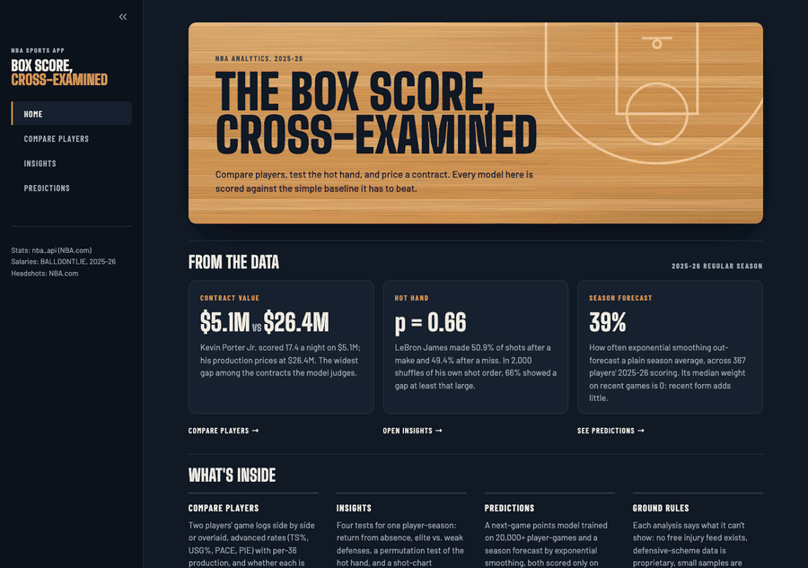

# NBA Player Stats App

An interactive Streamlit app for comparing NBA players, testing hypotheses about their performance, and forecasting their next games. It runs on `nba_api` data, and every model is reported next to the simple baseline it has to beat.

[](https://github.com/Aryaasd/nba-sports-app/actions/workflows/ci.yml)

---

## Live Demo

**[Try it live](https://nba-sports-app-jneksyc8sa3dsvprpkbxdq.streamlit.app/)**

> **About the hosted demo:** `stats.nba.com` blocks requests from most cloud hosts, including Streamlit Community Cloud. When live data can't be reached, the app falls back to a bundled **real** snapshot (LeBron James and Stephen Curry, 2025-26), and a banner says so. They're also the default players, so on the snapshot's season every page opens on working data. Any other selection shows an error, with a one-click switch back to the snapshot, rather than made-up data. Run it locally (see below) for live data on every player.



---

## Key Features

* **Compare Two Players:** season game logs for any two players, side by side or overlaid.
* **Contract Value:** whether each compared player is paid more or less than his 2025-26 production implies. The verdict comes from a cross-validated salary model. Rookie-scale, minimum-level, max, and partial-season deals are labeled rather than judged, because their pay isn't a free-market price.
* **Advanced Metrics:** TS%, USG%, PACE, and PIE from `nba_api`'s advanced stats, plus hand-computed per-36 rates.
* **Insights:** four hypothesis-driven analyses for one player-season:
  * **Absence & Rest Impact** — performance in the games right after missed time, compared with the player's own season baseline.
  * **Performance vs. Defense** — scoring against opponents bucketed by measured `DEF_RATING`.
  * **Hot Hand Fallacy** — a permutation test of whether makes and misses are streakier than chance, in the spirit of Gilovich, Vallone & Tversky (1985) and the Miller & Sanjurjo (2015) bias correction.
  * **Shot Chart** — a field-goal-percentage heatmap on a hand-drawn court, with low-attempt bins muted so small samples don't look like signal.
* **Predictions:** two forecasting techniques, each scored only on games it hadn't seen:
  * **Next-Game Points Model** — a Ridge regression trained on 20,932 player-games, evaluated on a full unseen season with bootstrap confidence intervals. It shows a per-player backtest chart and a next-game projection.
  * **Season Forecast** — simple exponential smoothing on one player's own season, validated walk-forward. The fitted smoothing weight is itself a finding (see below).
* **Resilient demo:** a circuit breaker and a labeled sample-data fallback, so the hosted app never dead-ends on a blocked API.

---

## Model Evaluation

The goal was to find out honestly how well next-game stats *can* be predicted, not to make a model look good. Two rules apply to every number below: a prediction only ever uses games played before it, and every model is compared against simple averages.

### Next-game points: Ridge regression

**Setup**
- **Training data:** every player's 2024-25 regular season (20,932 player-games after each player's first 10).
- **Features:** trailing 5- and 10-game averages of points, rebounds, assists, and minutes, plus days of rest and home/away.
- **Validation:** 5-fold time-series cross-validation, split on whole dates so a single night never straddles train and validation. The **entire 2025-26 season** is a holdout the model never saw.

| Model | CV MAE (2024-25) | Holdout MAE (2025-26) | Holdout RMSE |
|---|---:|---:|---:|
| 5-game average (naive baseline) | 4.914 | 4.867 | 6.376 |
| 10-game average (stronger baseline) | 4.777 | 4.716 | 6.181 |
| **Ridge regression** | **4.759** | **4.708** | **6.115** |
| Random forest (comparison only) | 4.779 | 4.723 | 6.132 |

To test whether those gaps are real rather than noise, the holdout improvements have 95% confidence intervals from a **cluster bootstrap that resamples whole players**, since one player's games aren't independent of each other:

| Ridge vs. | MAE improvement | 95% CI | Verdict |
|---|---:|---|---|
| 5-game average | +0.159 pts | [+0.135, +0.183] | Ridge is better |
| 10-game average | +0.008 pts | [−0.006, +0.021] | Statistically tied |

**What this shows**
- The model genuinely beats a 5-game average, but it **ties a plain 10-game average**. The features add nothing measurable beyond a longer averaging window, and the app says so rather than claiming a 0.2% "win".
- Single-game scoring is mostly noise around a player's level. With a typical miss near 4.7 points, the floor is close to what any box-score model can reach.
- A nonlinear random forest didn't beat Ridge either, so the simpler, interpretable model ships.

### Season forecast: exponential smoothing

Each player's season is treated as a time series. At every game *k*, three forecasters see only games 1..*k*−1 and predict game *k* (rolling-origin evaluation). Results across **367 players with 40+ games in 2025-26**:

| Stat | Smoothing MAE | Season-mean MAE | Last-game MAE | Smoothing beats season mean | Median fitted α |
|---|---:|---:|---:|---:|---:|
| PTS | 4.72 | 4.74 | 6.05 | 39% of players | 0.00 |
| REB | 1.95 | 1.93 | 2.49 | 37% of players | 0.00 |
| AST | 1.38 | 1.37 | 1.72 | 39% of players | 0.00 |

- Smoothing ties the season-to-date average, and both beat "last game carried forward" by about 22%.
- **The median fitted smoothing weight is 0**: for the typical player, the best forecast puts no extra weight on recent games. That's the hot-hand question asked per game instead of per shot, with the same answer — recent form carries little signal beyond a player's season level.

### Contract value: production-implied salary

**Setup**
- **Data:** standard 2025-26 contracts (cap hits) from the [BALLDONTLIE API](https://www.balldontlie.io/), whose terms allow publishing and modeling it. Salary sites whose terms forbid scraping or predictive use were deliberately avoided.
  - The source has no two-way contracts.
  - A player waived mid-season appears only with his final contract.
- **Join:** contracts are joined to 2025-26 `nba_api` stats by normalized name, plus seven nickname aliases.
  - 493 of 505 contracts matched; the other 12 players didn't play that season.
  - In the other direction, 89 players with minutes have no contract on file (mostly two-way players), and 15 of them played enough to judge. The app says so instead of guessing.
- **Model:** it predicts log salary from minutes, points, rebounds, assists, usage, true shooting, PIE, and age.
- **Training set:** salaries are only market prices between the league's floor and ceiling, so the model learns from **154 market-priced contracts plus 36 max deals**. These are left out:
  - **rookie-scale deals**, set by the league's pay scale (identified exactly from contract type, not guessed from draft year);
  - **minimum-level deals**, up to $3.63M (the top of the minimum-salary scale), which sit on a price floor;
  - **ten-day and rest-of-season deals**, whose cap hit isn't an annual salary;
  - **players with under 20 games or 10 minutes a game.**

  Players outside the training set are still valued; they just never get an over/underpaid verdict.

| Model (5-fold CV × 10 repeats, scored on the 154 market-priced contracts) | Typical miss | Median % error | R² (log salary) | Max deals priced well below |
|---|---:|---:|---:|---:|
| Minutes only (baseline) | 1.55x | 37% | 0.13 | 61% |
| **Ridge regression** | **1.52x** | **35%** | **0.26** | 28% |
| Censored (Tobit) regression, max deals read as lower bounds | 1.57x | 36% | 0.16 | 8% |

**Choices the data settled**
- **Minimum deals as bounds failed.** A two-sided censored regression read minimum deals as "worth *at most* the minimum" and max deals as "worth *at least* the max". It collapsed: typical miss 2.17x, R² below zero. Plenty of productive veterans sign for the minimum to join a contender, so that bound simply isn't true.
- **Max deals stay in, as real prices.** Dropping them left the model blind to star salaries: it called Stephen Curry and Cade Cunningham overpaid. Keeping them as signed prices was the most accurate option. It's also right for this question: a max deal was the market's price when signed, so a star who has declined since really is paid above his current production.

**How verdicts work**
- Every player is valued **out-of-fold**, by models that never saw his own salary. The result is averaged over 10 repeated cross-validation runs, so a verdict doesn't depend on one random fold split.
- A gap within the model's typical miss (1.52x either way) counts as **fairly paid**. Only bigger gaps are called above or below production.
- **Labels instead of verdicts:**
  - Rookie-scale, minimum-level, and partial-season deals get a label, not a verdict.
  - So does a max player whose production prices *above* his salary ("Max contract"): the cap, not the market, holds his pay down.

**What this shows**
- **Box-score production explains only about a quarter of the variation in market-priced salaries,** barely more than minutes alone. Most of what the market prices is invisible in one season's box score: past seasons, projected growth, injury history, and when a player hit free agency.
- **The verdicts are balanced (37 above production, 36 below), and the extremes are recognizable.**
  - Above production: Khris Middleton, Jalen Suggs, Isaiah Hartenstein.
  - Below production: Kevin Porter Jr., Ryan Rollins, Saddiq Bey.
- **Known blind spot:** box scores capture defense poorly, so defensive specialists such as Evan Mobley and OG Anunoby can look paid above their production.
- **The model learns what the market pays for, not what wins games.** "Paid above production" means priced differently from the market, not a bad contract.

### Limitations

* Box scores only. There's no injury, minutes-restriction, opponent, or lineup information; no free source exists for the first two.
* The model is trained on one season. A different era, or a rule change, could shift the relationships.
* The next-game projection needs rest days and home/away as user inputs, because the app has no schedule feed.
* Point forecasts only; no prediction intervals.

Reproduce the numbers with `python -m scripts.train_model` (about 10s), `python -m scripts.evaluate_forecast` (about 1 min), and `python -m scripts.train_contract_model` (seconds; runs on the committed contract snapshot). The first two pull live data, so run them from a non-cloud machine.

---

## Tech Stack

* **Core:** Python, Streamlit
* **Data:** Pandas, NumPy, `nba_api`, BALLDONTLIE API (contracts), Parquet (bundled snapshots)
* **Modeling:** scikit-learn (Ridge, random forest, `TimeSeriesSplit`; training only), statsmodels (exponential smoothing), SciPy (a hand-written censored/Tobit regression), cluster bootstrap for confidence intervals
* **Visualization:** Altair
* **Testing/CI:** pytest, ruff, GitHub Actions

---

## Getting Started

### Prerequisites

* Python 3.11+
* `pip`

### Installation & Setup

1. **Clone the repository:**
   ```bash
   git clone https://github.com/Aryaasd/nba-sports-app.git
   cd nba-sports-app
   ```

2. **(Recommended) Create and activate a virtual environment:**
   * **Windows:**
     ```bash
     python -m venv .venv
     .\.venv\Scripts\activate
     ```
   * **macOS / Linux:**
     ```bash
     python3 -m venv .venv
     source .venv/bin/activate
     ```

3. **Install the required dependencies:**
   ```bash
   pip install -r requirements.txt
   ```

4. **Run the Streamlit app:**
   ```bash
   streamlit run sports_app.py
   ```

---

## How It Works

The app is split into small, single-purpose modules:

* **`data.py`** — every `nba_api` call. Each is cached for an hour with `@st.cache_data`, retried once, and guarded by a circuit breaker: after a network failure, live calls pause for 10 minutes instead of re-waiting out the timeout on every request. On failure it falls back to the bundled snapshot, but only for the exact selections that snapshot covers.
* **`metrics.py`** — pure logic: season strings, player lookup, TS% and per-36 math.
* **`modeling.py`** — next-game feature engineering and inference, shared by training and the live app so the two can't drift apart.
  * Each feature is built from the player's own earlier games only: shifted one game, computed per player, and requiring a full window.
  * The model ships as plain JSON coefficients (`model/next_game_points.json`), so the deployed app doesn't need scikit-learn.
* **`model_training.py`** — date-block time-series CV, model fitting, player-clustered bootstrap CIs, and coefficient export (scikit-learn).
* **`contract_training.py`** — the contract-value pipeline: training-set rules, cross-validated model comparison, and out-of-fold valuation (scikit-learn; offline only).
* **`contract_data/`** — the dated contracts snapshot and precomputed contract values. The app reads results only, so it never needs an API key. See [`contract_data/README.md`](contract_data/README.md).
* **`insights/`** — one module per analysis (`absence.py`, `defense_tiers.py`, `hot_hand.py`, `shot_chart.py`, `forecast.py`, `contract_value.py`). Each is honest about a real data limitation:
  * No free injury-designation feed exists, so **Absence & Rest Impact** measures games missed, never *why* they were missed.
  * Defensive-scheme data is proprietary, so **Performance vs. Defense** buckets opponents by measured `DEF_RATING` instead.
  * **Hot Hand** shuffles each game's own shot sequence thousands of times, to sidestep the selection bias in the original 1985 analysis.
  * Every analysis returns an explicit "not enough data" result instead of a misleading number from a tiny sample.
* **`sample_data_loader.py` + `sample_data/`** — the bundled real snapshot used when the live API is unreachable. See [`sample_data/README.md`](sample_data/README.md) for its provenance.
* **`scripts/`** — one-off jobs:
  * `train_model` — trains and evaluates the model, and writes the JSON.
  * `evaluate_forecast` — the league-wide forecast table above.
  * `capture_sample_data` — refreshes the snapshot.
  * `fetch_contracts` — one-time pull of 2025-26 contracts (needs a BALLDONTLIE key).
  * `train_contract_model` — joins contracts to stats, cross-validates, and writes the contract values.
* **`charts.py`** — Altair chart builders and a dark theme with colorblind-safe categorical and diverging colors.
* **`ui.py` + `ui.css`** — the visual system: a hardwood hero, player cards with NBA.com headshots and team colors, and styling for Streamlit's own widgets. `ui.py` returns escaped HTML strings, so the markup is unit tested; `.streamlit/config.toml` shares the same palette and fonts.
* **`about_page.py`** — the in-app About page: data sources, how each page works, the ground rules, and a results table read from the committed model files.
* **`sports_app.py`** — thin Streamlit UI glue, with no data-fetching or stat-math logic of its own.

---

## Running Tests

```bash
pip install -r requirements-dev.txt
pytest
ruff check .
```

Every logic module is unit tested with mocked `nba_api` calls, so tests never hit the network. The tests that matter most guard the evaluation itself:
* CV folds never train on a date at or after their validation dates.
* No player's own salary ever informs his contract valuation.
* The censored regression recovers a known slope on simulated data, where the naive fits are biased.
* Walk-forward forecasts never see the game they predict.
* Rolling features never include the current game or another player's history.
* The exported JSON coefficients reproduce scikit-learn's predictions.
* The fallback never serves sample data for a selection outside the snapshot.

The Streamlit UI itself isn't tested; it's kept thin enough that the logic it calls is what's verified.

---

## Deploying Your Own Copy

1. Push your fork to GitHub.
2. Sign in to [share.streamlit.io](https://share.streamlit.io) with GitHub.
3. Click **New app**, select your repo/branch, and set the entry file to `sports_app.py`.
4. Deploy.

---

## License

Distributed under the MIT License. See [`LICENSE`](LICENSE) for more information.
